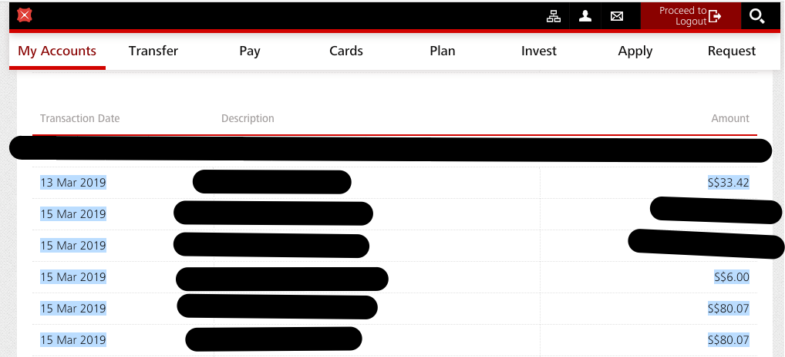

# DBS & POSB Bank Credit Card Transactions Parser

## Motivation

It's pretty annoying that my local DBS Bank in Singapore doesn't allow downloading of transaction in CSV format. Seriously? They only allow downloads in PDF, so what good is that...

So I figured let's make a parser to convert the data to .csv.

## How to use

You'll need to have Elixir installed on your machine.

Clone the repo and run `mix deps.get`.

#### Get to your DBS Internet Banking portal

You need to go to the page
```
Cards > Credit Cards Summary > **Your desired card**
```

Under `Current Statement` it should look something like this:



Highlight all the transactions from date column to the last row (excluding the subtotal). Right click and `copy` or just hit `Ctrl + V`.

Create any file in the root folder and paste the content from your DBS credit card page. It should look like this:

```
13 Mar 2019   DELIVEROO.COM.SG  S$33.42
15 Mar 2019   FAVEPAY   S$24.70
15 Mar 2019   GRAB *4435999-9-024   S$11.00
```

Open your console and run `iex -S mix`. You are now in Elixir console.

In the console, run the command 
```elixir 
BankParser.parse_file(file)
```
where `file` is the filename where you saved the transactions.

Check your root folder and you should find a file `output.csv`!

## Safety
In case you are wondering, this application doesn't send your data anywhere. It just stays locally on your machine.